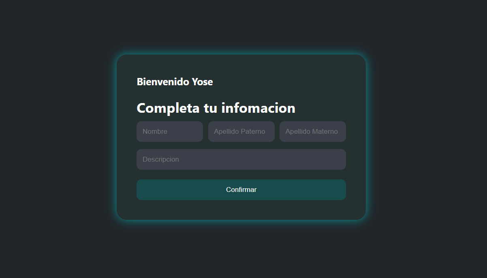
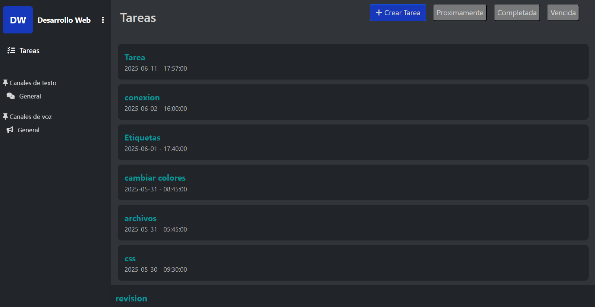

# Workly

## INDICE

1. Proyecto
2. Objetivos
3. Capturas de Pantalla
4. Tecnologias 
5. Idioma

### Proyecto

Aplicacion web que consume servicios web para transferir información entre la aplicación y un servidor web (modelo cliente-servidor).

### Objetivos

El sistema tiene como objetivo principal la comunicación, enviar y recibir información en tiempo real a través de internet.
Cuenta con las herramientas necesarias para la comunicación, como el uso de chats en tiempo real, subida y descarga de archivos, chats privados y creación de chats grupales de mínimo tres integrantes.
Gestion de tareas por Grupo y Manejo de Recompensas 

### Capturas de Pantalla

Pantallas de mi Aplicacion Web

### Tecnologias
Este proyecto fue realizado con:
* PHP
* JavaScrip
* Html
* Css
* Mysql
* Firabase
* Supabase

### Idioma
Español.
